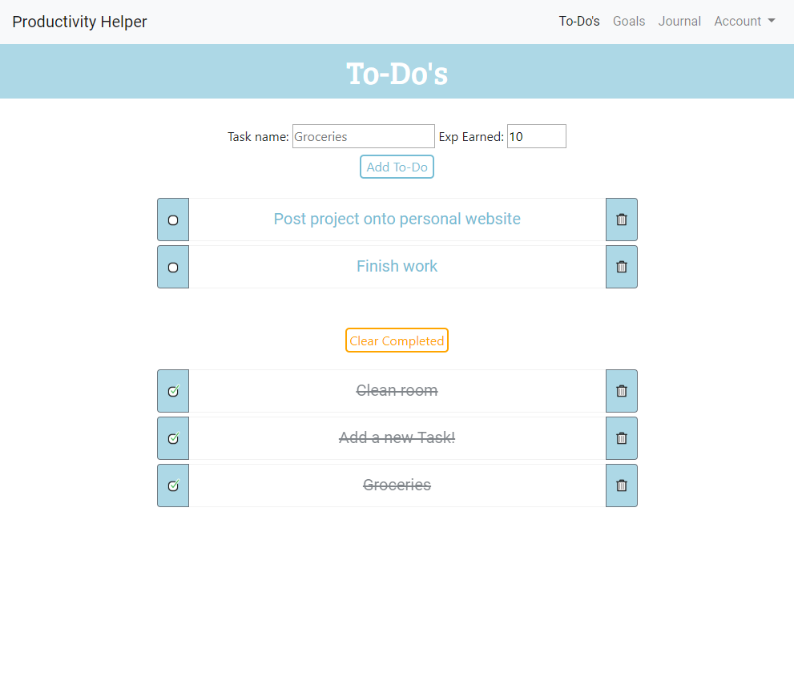
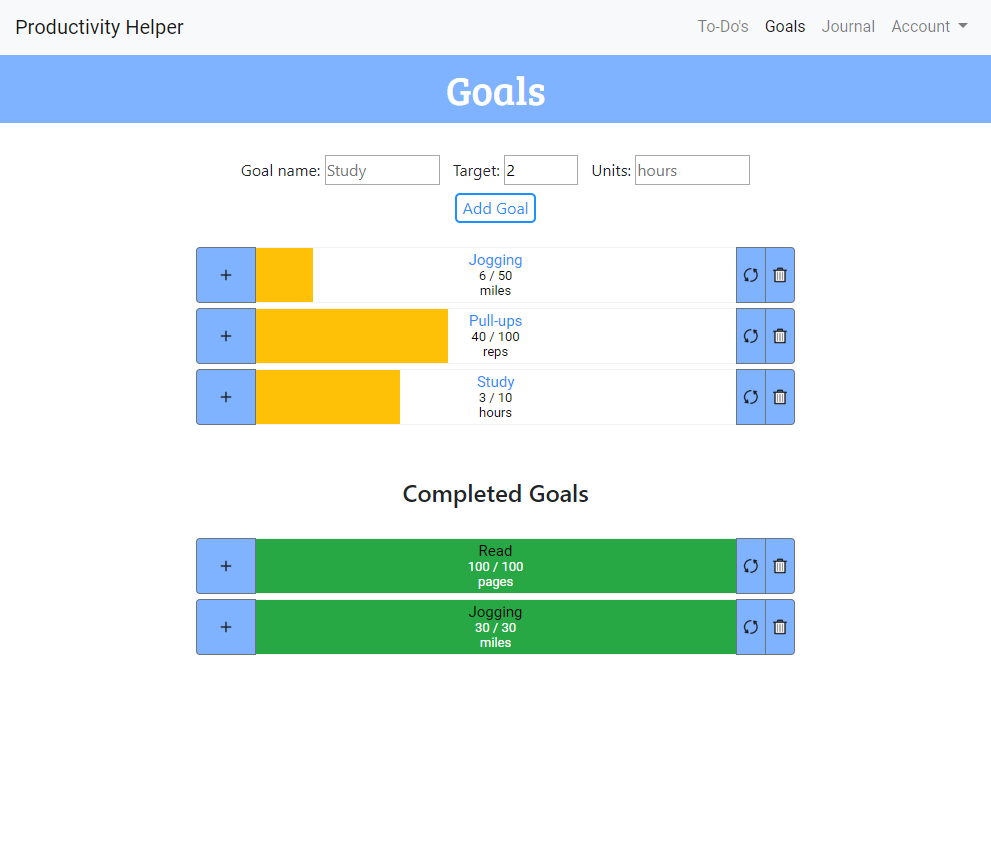
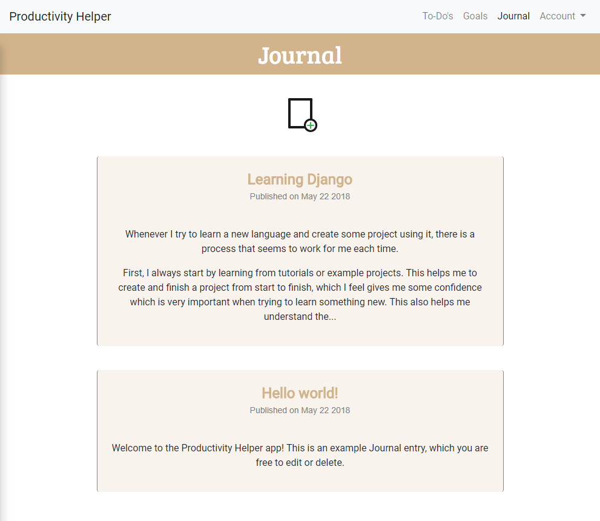
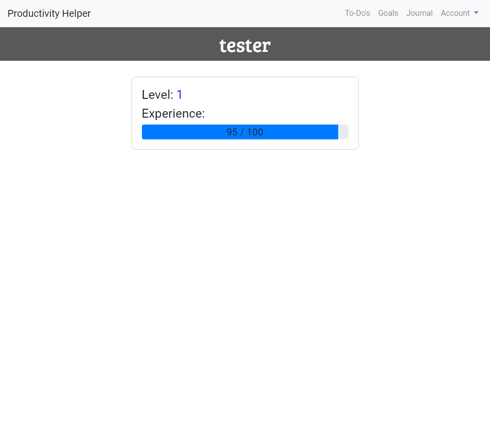

# Productivity Helper  
Application that helps you keep track of your tasks and long-term goals to stay more productive.  
Written in Python using the Django framework.  
It is inspired by To-do list and Goal-setting apps.  

Check it out LIVE [here](josephtkim.pythonanywhere.com)  

## Tools:  
* [Django framework](https://www.djangoproject.com/)  
* [Python](https://www.python.org/)  

## FEATURES:  
* To-Do list for keeping track of quick one-time tasks  
* Goal list for keeping track of longer term tasks  
* Journal for writing down your progress or personal thoughts  
* Gain Exp points for completing tasks or goals, which are updated with your profile  
* Mobile friendly design  

## CREDITS:  
* Icon Art: Isaac Kim  
